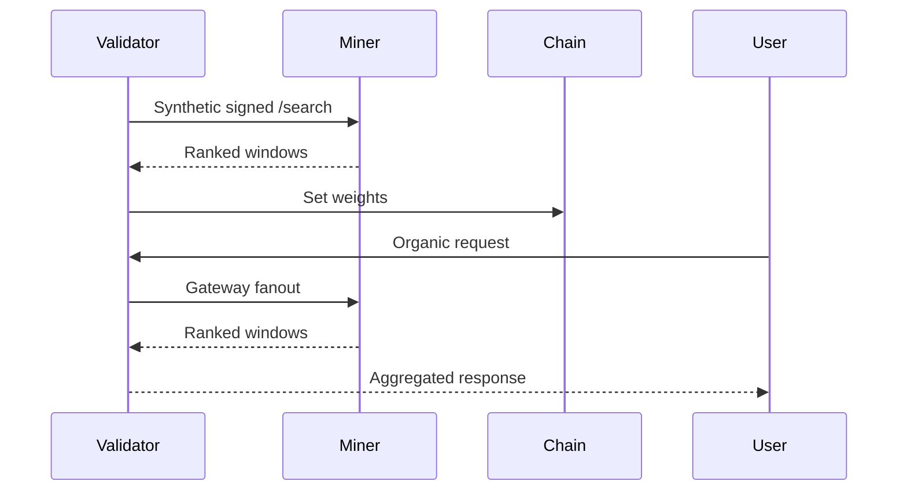
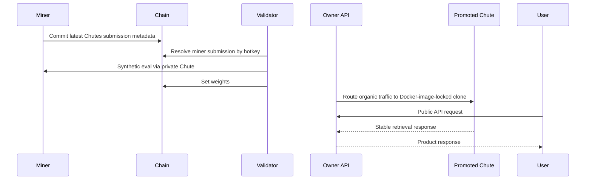

# Design Document: ChronoSeek

## 1. Purpose

This document describes:

- the currently deployed `v1.x` testnet architecture
- the target `v2.0` architecture built around the `Eval/Serve Split`

`Eval/Serve Split` is the engineering name for the new mechanism:

- `eval plane`: synthetic validator evaluation and on-chain weight setting
- `serve plane`: owner-controlled public API for organic traffic

The full v2.0 source of truth is [ChronoSeek v2.0 Eval/Serve Split](./CHRONOSEEK_V2_EVAL_SERVE_SPLIT.md).

## 2. Version Summary

### `v1.x` current architecture

- validators generate ActivityNet-based synthetic tasks
- validators query live miner endpoints directly
- validators score miner responses and set weights
- validators may also expose a public gateway that forwards organic traffic to ranked responsive miners

### `v2.0` target architecture

- miners deploy full retrieval runtimes to private Chutes
- miners commit structured deployment metadata on-chain
- validators resolve the latest valid miner submission from chain state
- validators query private miner Chutes for synthetic evaluation only
- the owner-run API serves organic traffic from promoted immutable Chutes clones
- promoted clones are locked to the exact Docker image that was running at clone time

## 3. Core Problem Definition

**Input**

- untrimmed video or accessible video URL
- natural-language query

**Output**

- one or more temporal intervals with confidence scores

The core retrieval problem is unchanged across versions.

## 4. `v1.x` Deployed Data Flow

1. Validator samples a synthetic task from ActivityNet Captions.
2. Validator filters inaccessible source videos if configured.
3. Validator sends signed `/search` requests to selected miner endpoints.
4. Miner downloads the video, runs retrieval, optionally extracts and scores speech transcripts, and returns ranked windows.
5. Validator computes best-match IoU and updates moving scores.
6. Validator sets on-chain weights.
7. Optional validator gateway fans out organic traffic to currently responsive miners.

## 5. `v2.0` Target Data Flow

### 5.1. Synthetic evaluation plane

1. Miner trains or improves a retrieval runtime.
2. Miner deploys that runtime to a private Chutes deployment.
3. Miner commits structured deployment metadata on-chain, keyed by hotkey.
4. Validator samples a synthetic task.
5. Validator resolves the latest valid miner submission from chain state.
6. Validator queries the miner's private Chutes deployment.
7. Validator scores the result with the existing synthetic scoring loop.
8. Validator updates weights.

### 5.2. Organic serving plane

1. Subnet owner selects a winning or approved miner submission.
2. Chutes clones the private deployment into an immutable public deployment.
3. The promoted clone is locked to the exact Docker image that was running at clone time.
4. The owner-run API routes organic traffic only to promoted Chutes clones under operator control.
5. Product auth, billing, rate limiting, uptime, and rollback stay outside the subnet.

## 6. High-Level Diagrams

### `v1.x`

### `v2.0`

## 7. Validator Design

### 7.1. `v1.x`

Validators are both:

- the scoring layer
- an optional public gateway layer

They currently:

- generate synthetic tasks
- track miner responsiveness
- query miner endpoints directly
- aggregate gateway traffic

### 7.2. `v2.0`

Validators remain only the scoring and chain-update layer.

They should:

- generate synthetic tasks exactly as today
- stop treating miners as the production serving path
- resolve miner deployment metadata from chain state
- query private Chutes directly for evaluation
- keep scoring, weight aggregation, and incentives unchanged unless later revised explicitly

## 8. Miner Design

### 8.1. `v1.x` current miner runtime

The reference miner currently performs:

1. video download
2. CLIP-based visual retrieval
3. transcript extraction and scoring
4. simple fusion
5. ranked interval output

### 8.2. `v2.0` miner submission unit

The important design change is that miners are no longer treated as only live HTTP servers.

The miner submission unit becomes a hosted retrieval runtime. That runtime can include:

- video acquisition logic
- preprocessing
- frame and clip traversal
- transcript extraction
- retrieval logic
- ranking and protocol formatting

This is intentionally broader than "just a model."

Because the Chutes promotion flow locks the exact Docker image running at clone time, a winning full runtime can become the owner-operated public-serving artifact.

## 9. Chutes Integration

### 9.1. `v1.x` informal Chutes usage

Chutes may be used by miners as an internal inference backend, but the validator still reasons about miners primarily as live endpoints.

### 9.2. `v2.0` formal Chutes-backed design

Chutes becomes part of the canonical miner submission and promotion flow:

1. miners deploy private Chutes
2. validators evaluate private Chutes
3. subnet admins can promote selected deployments
4. promoted Chutes clones become immutable public serving artifacts
5. promoted artifacts are locked to the exact Docker image that was running at clone time

This solves the main reliability issue with organic traffic:

- miners remain decentralized and replaceable
- the public API stops depending on live miner fanout

## 10. On-Chain Submission Metadata

`v2.0` should commit structured metadata, not only a raw endpoint URL.

Recommended fields:

- `protocol_version`
- `submission_type`
- `hotkey`
- canonical Chutes identifier such as `chute_id`
- resolved endpoint slug if safe to include
- `artifact_id`
- `artifact_revision`
- `artifact_digest`
- `capabilities`
- `created_at_block`

This allows validators to:

- discover the latest valid submission per miner
- distinguish mutable endpoint references from immutable runtime identity
- reject malformed or stale submissions deterministically

## 11. Public API Design Implication

### `v1.x`

The developer API ultimately depends on validator gateway fanout to miners.

### `v2.0`

The public API becomes a product service, not a subnet routing trick.

It should:

- authenticate users and API keys
- meter credits and usage
- route only to owner-controlled promoted Chutes clones
- route organic traffic to the selected Docker-image-locked clone
- support rollback and champion/challenger promotion logic

## 12. What Stays The Same

The following can remain unchanged in the first `v2.0` implementation step:

- synthetic task generation approach
- scoring function
- moving-average weight aggregation
- protocol request and response shape where possible

The main change is not the reward function. It is the serving and deployment boundary.
