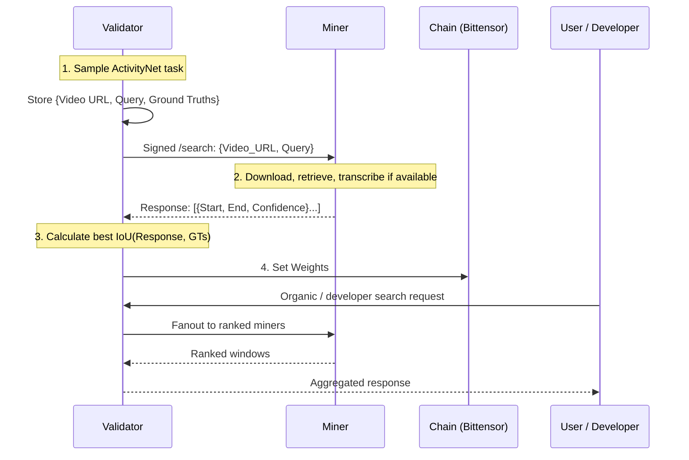

# Design Document: ChronoSeek

## 1. Introduction

ChronoSeek provides a decentralized service for retrieving specific video moments based on natural language queries. This document outlines the current deployed subnet architecture and the next-step roadmap toward fuller multimodal understanding.

## 1.1. Current Network Status

- The subnet is functioning on testnet end to end.
- Validators run deterministic ActivityNet-based evaluation for scoring and on-chain weight updates.
- Miners currently support visual retrieval plus transcript-based speech understanding.
- Validators can also expose a public protocol-compatible gateway for application and developer traffic.
- The next major milestone is full multimodality: vision + speech + non-speech sound understanding.

## 2. Core Problem Definition

**Input:**
- Untrimmed Video $V$ (or video features)
- Natural Language Query $Q$

**Output:**
- A set of temporal intervals $\{ (s_i, e_i, score_i) \}$ where $s_i$ is the start time, $e_i$ is the end time, and $score_i$ represents the confidence that the segment matches the query $Q$.

## 3. Overall Subnet Architecture

The subnet operates as a competitive market for semantic video understanding.

### 3.1. High-Level Data Flow

1.  **Task Generation (Validator):** The validator samples a task from ActivityNet Captions, preserving the human-written caption and one or more ground-truth intervals.
2.  **Availability Filtering:** When configured, the validator skips inaccessible source videos, records availability in cache, and can fall back to previously confirmed accessible videos.
3.  **Broadcast:** The query (video URL + text description) is sent to selected responsive miners over signed HTTP requests.
4.  **Inference (Miner):** Miners download the video, run visual retrieval, optionally extract and transcribe speech, and return ranked timestamp intervals.
5.  **Scoring (Validator):** The validator compares miner intervals with the ground truths using best-match IoU.
6.  **Weight Setting:** Step scores are folded into moving averages and normalized into on-chain weights.
7.  **Gateway Serving:** The validator gateway can also aggregate miner responses for organic and developer-facing search traffic.

### 3.2. Component Interaction Diagram



## 4. Incentive Design

The incentive mechanism is the core driver of the subnet. In the current deployed version, it primarily rewards retrieval accuracy measured by IoU.

### 4.1. Scoring Function

For a single query $q$, a miner returns a list of predicted intervals $P = \{p_1, p_2, ...\}$. The Ground Truth is a set of one or more valid intervals $G = \{g_1, g_2, ...\}$.

The score $S$ for a query is calculated as the best **Intersection over Union (IoU)** across all prediction / ground-truth pairs.

$$ \text{IoU}(p, g) = \frac{\text{intersection}(p, g)}{\text{union}(p, g)} $$

We define the current reward function as:

$$ R(P, G) = \max_{p \in P, g \in G} \left( \text{IoU}(p, g) \right) $$

This returns a continuous score in `[0, 1]`.

**Latency today:**
Latency is tracked operationally and exposed in validator logs, but it is not currently part of the on-chain scoring formula.

### 4.2. Aggregation & Weights
- Scores are maintained as moving averages over repeated validation steps.
- Validators seed scores from the metagraph incentives when possible, then update them with each new step score.
- Weight setting is based on normalized moving scores.

## 5. Validator Design

Validators are the quality and routing layer. They generate scored evaluation tasks, track miner responsiveness, and optionally expose a public gateway.

### 5.1. Synthetic Task Generation Pipeline

The deployed validator uses a deterministic ActivityNet-based task pipeline:

1.  **Dataset Source:** Load ActivityNet Captions from Hugging Face or a local manifest.
2.  **Task Selection:** Randomly select a row from the configured split and preserve its caption plus one or more valid timestamp intervals.
3.  **Video Availability Check:** Optionally verify that the source video is currently accessible and cache both accessible and inaccessible URLs.
4.  **Fallback Strategy:** If newly sampled videos are inaccessible, fall back to a cached accessible video so validator loops can continue operating on testnet.

### 5.2. Organic Traffic Routing
- Validators can expose `/health`, `/capabilities`, `/search`, and `/search/stream`.
- Organic and developer requests are forwarded to top-ranked responsive miners.
- Results are aggregated, deduplicated, ranked by confidence, and returned in the shared ChronoSeek protocol shape.

## 6. Miner Design

Miners are free to implement *any* architecture. However, we provide reference implementations to bootstrap the network.

### 6.1. Version 1.0 Baseline: Vision + Speech Transcript Retrieval
*Deployed on testnet today.*
1.  **Video Download:** Fetch the source video locally on the miner.
2.  **Visual Retrieval:** Run a CLIP-based coarse-to-fine search over extracted frames to produce candidate temporal windows.
3.  **Speech Extraction:** Extract audio, transcribe speech, and score transcript segments against the query.
4.  **Fusion:** Keep vision as the primary signal and apply transcript-derived audio as a secondary boost when it improves confidence.
5.  **Localization:** Return ranked timestamp intervals with confidence scores.

### 6.2. Version 2.0 Direction: Full Multimodality
*Current active direction.*
- **Vision:** Keep improving temporal localization beyond the current CLIP baseline.
- **Speech:** Move from transcript-only use toward stronger spoken-language understanding.
- **Non-speech audio:** Add event-level sound understanding so queries can match applause, crashes, music cues, animal sounds, engine noise, and similar signals that transcripts miss.
- **Fusion:** Move toward a true multimodal scoring stack instead of the current vision-primary, transcript-boost approach.

### 6.3. Tier 3: LLM Agents (Future)
- Miners run a VLM (like Video-LLaMA) that "watches" the video and reasons: *"I see a car here, but it's blue. The user asked for a red truck. I will skip."*

### 6.4. Chutes (SN64) Integration

Chutes (Subnet 64) serves as the scalable inference layer for ChronoSeek.

#### Version 1.0: Miner-Side Inference
In the 1.0 architecture, miners use Chutes as a serverless backend to run their own models.
1.  **Deploy:** Miner deploys their custom model image (e.g., Moment-DETR) to Chutes.
2.  **Call:** Miner's Synapse `forward` function calls the Chutes API.
3.  **Benefit:** Miners don't need to rent idle H100s; they pay per inference via SN64.

#### Version 2.0: Decentralized Inference (Validator Verification)
In 2.0 and later, we move to a "Proof of Model" approach where Validators can directly verify the model running on Chutes.
1.  **Commitment:** Miner uploads their model to Chutes and commits the `chute_id` and `miner_hotkey` metadata to the Bittensor chain.
2.  **Verification:** Validators read the metadata and can send inference requests *directly* to the Miner's Chute to verify latency and accuracy, bypassing the Miner's local proxy.
3.  **Efficiency:** This reduces hop latency and ensures the code running is exactly what was promised.

```python
# Example Miner Forward Logic using Chutes (Version 1.0)
import requests

def forward(self, synapse: VideoSearchSynapse) -> VideoSearchSynapse:
    payload = {
        "video_url": synapse.video_url,
        "query": synapse.query
    }
    # Call the deployed Chute
    response = requests.post(
        "https://api.chutes.ai/miner/my-moment-detr",
        json=payload,
        headers={"Authorization": f"Bearer {self.chutes_api_key}"}
    )
    synapse.results = response.json()['results']
    return synapse
```

## 7. Request/Response Protocol

### 7.1. Synapse Definition (Pydantic)

```python
import bittensor as bt
from typing import List, Optional
from pydantic import BaseModel

class VideoSearchResult(BaseModel):
    start: float
    end: float
    confidence: float

class VideoSearchSynapse(bt.Synapse):
    # Input
    video_url: str
    query: str
    
    # Output
    results: List[VideoSearchResult] = []
    
    # Optional: Metadata for debugging
    miner_metadata: Optional[dict] = {}
```

## 8. Research & SOTA Approaches

Recent research (2024-2025) highlights several key directions:

### 8.1. Large Language Model (LLM) Enhanced Retrieval
- **Concept:** Use LLMs to bridge the gap between complex natural language queries and visual features.
- **Papers:** ["Context-Enhanced Video Moment Retrieval with Large Language Models"](https://arxiv.org/abs/2405.12540) (Weijia Liu., 2024).
- **Application:** Miners can use LLMs to expand queries or reason about the video content before retrieval.

### 8.2. Contrastive Learning & CLIP-based Approaches
- **Concept:** Leverage pre-trained Vision-Language Models (VLMs) like CLIP to align video frames/segments with text queries.
- **Papers:** ["Video Corpus Moment Retrieval with Contrastive Learning"](https://arxiv.org/abs/2105.06247) (Hao Zhang., 2021).
- **Application:** A strong baseline for miners is to extract frame embeddings using CLIP and compute cosine similarity with the query embedding across a sliding window.

### 8.3. Proposal-Free / Regression Approaches
- **Concept:** Instead of ranking pre-defined proposals (sliding windows), directly predict start/end timestamps.
- **Papers:** ["Moment-DETR"](https://arxiv.org/abs/2107.09609) (Jie Lei., 2021), ["Time-R1"](https://arxiv.org/abs/2503.13377) (Boshen Xu., 2025).
- **Application:** More efficient for long videos but requires more specialized model training.

### 8.4. Bias Mitigation
- **Concept:** Datasets often have temporal biases (e.g., moments often at the beginning). SOTA methods use causal inference to de-bias.
- **Relevance:** Validators must ensure synthetic queries do not favor trivial baselines (e.g., "always guess the middle").
